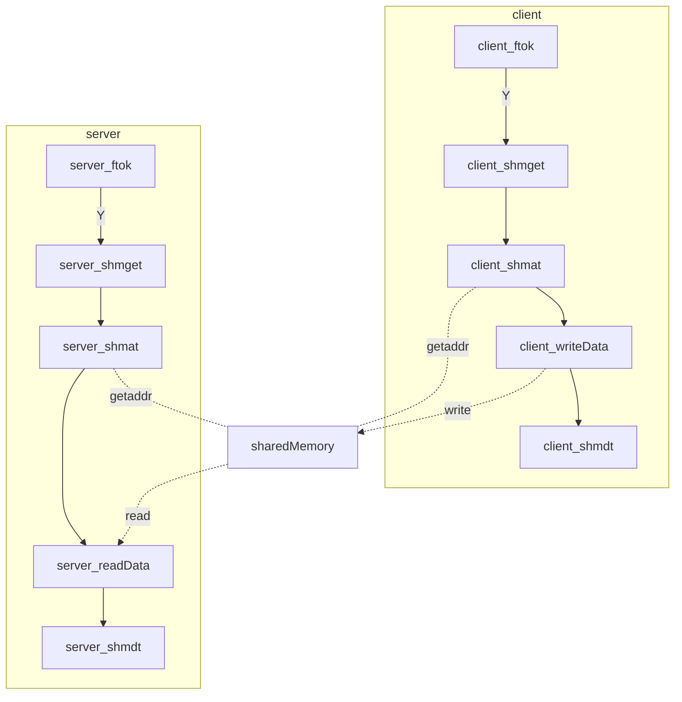

# sharememory

- method

```mermaid
graph TB;

subgraph client
  client_ftok-->|Y|client_shmget
  client_shmget-->client_shmat
  client_shmat-->client_writeData
  client_writeData-->client_shmdt
end
subgraph server
  server_ftok-->|Y|server_shmget
  server_shmget-->server_shmat
  server_shmat-->server_readData
  server_readData-->server_shmdt
end

server_shmat-.-|getaddr|sharedMemory
client_shmat-.-|getaddr|sharedMemory
sharedMemory-.->|read|server_readData
client_writeData-.->|write|sharedMemory

```
