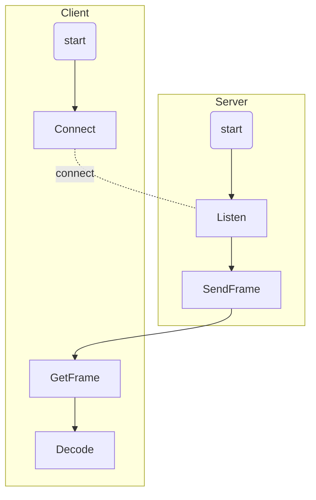

# MJPEG

- 目标：测试将已有的jpeg图片以MJPEG流方式在网络之间传输;服务器端一侧编码并发送MJPEG流，客户端接受MJPEG流并解码或者直接通过VLC播放器进行播放
- 方法：通过http进行网络之间的交互
## 简介
0. MJPEG（Motion Joint Photographic Experts Group）是一种视频压缩格式，其中每一帧图像都分别使用JPEG编码，不使用帧间编码，压缩率通常在20:1-50:1范围内
1. MJPEG改良了帧间预测机制，提高了纠错和网络兼容性，对网络传输具有更好的支持功能。但是每个生产商的网络摄像机适用的网络都有限定性。
2. 网络兼容性强，不管网络是CDMA，GPRS，WCDMA还是CDMA2000都能一样使用。
3. MJPEG网络传输网络占用大大，适用于短距离的无线监控，长距离手机、IPAD无线监控网络达不到传输要求，画面效果差。在不稳定网络环境下发生丢包等错误，视频文件易丢失。
4. MJPEG由JPEG专家组制订，并不是一个标准的压缩方式，每个厂家都有其自己的MJPEG版本，双方的文件互相无法识别传输。

## 实现流程

- 服务器不断从本地读图片，并向某个套接字以帧为单位发送数据。每帧包含一张图片的数据。
- 服务器向某个url与服务器建立连接。建立连接后，客户端不断接受数据并进行解码。



### 技术分解

- 简单http的连接和交互
- http的编解码
## 问题 

- 是否需要支持多个客户端同时访问同一服务器
- 性能要求：是否需要实时，是否允许数据的丢失
- RTP HTTP


## 具体实现
- 服务器和客户端源码地址
```
git clone https://github.com/NOLFXceptMe/http.git
```

### 数据流组织方式
- 数据流组织方式
  
```
      数据头部
      帧数据
      帧数据
      帧数据
      ...
      数据结束符
```


    - 数据头部
```

```
    //数据头部
    #define BOUNDARY   "boundry"
    
    tmp_httpResponse->setHTTPHeader("Content-Type", "multipart/x-mixed-replace;boundry="
      BOUNDARY);
    tmp_httpResponse->prepareResponse();
    tmp_httpResponse->addData("--"
      BOUNDARY
      "\r\n",strlen("--"
       BOUNDARY
       "\r\n"));
    
    ```
    
    - 帧数据
    
    ```
    //  帧头部
    sprintf(buffer, "Content-Type: image/jpeg\r\n"
      "Content-Length: %d\r\n"
       "\r\n",contentLength );
    //数据块的头部
    if(write(newsockfd,buffer,strlen(buffer))<0){
      break;}
    //  有效数据
     //数据块内容
    if(write(newsockfd,frame,contentLength)<0){
      break;}
    //  帧边界
    memset(buffer,0,BUFFER_SIZE);
      sprintf(buffer,"--"
      BOUNDARY
      "\r\n");
    cout<<"strlen(buffer):"<<strlen(buffer)<<endl;
     
    //数据块分隔
    if(write(newsockfd,buffer,strlen(buffer))<0){
      break;}
      
    ```
    
    - 数据结束符
    
      ```
      "--"+BOUNDARY+"--"
      ```


​      

- 数据举例

  ```
  //数据头
  HTTP/1.0 200 OK
  Date: Mon Mar 23 19:33:41 2020
  Server: Awesome HTTP Server
  Content-Type: multipart/x-mixed-replace;boundry=boundry
  
  --boundry
  
  //帧数据（循环）
  // 帧头
  Content-Type: image/jpeg
  Content-Length: 4899601
  
  //  有效数据
  ...(数据)
  
  //  帧边界
  --boundry
  
  注：注意换行符，数据举例中的换行未严格遵守规范。规范见数据头部和帧数据的代码。
  
  ```
### 服务端实现

- 仅对mjpeg编码部分进行修改

  - 接收数据时，判断request是否请求一个mjpeg流

  - 若请求流，则进入传送数据流的循环

  - 测试代码中，我们逐张读取本地图片，然后按照上述数据流的组织方式进行组织和放松

### 客户端实现

- 对返回的响应数据是mjpeg时，进入对数据流解码的循环

  - 简易过程如下

    ```
    //解码过程
    //recv -> save to buffer
    //find start["type_content:"], get image buffer size
    //  no:   rm meanless,continue
    //  yes:  find boundry ["--boundry--"]
    //      yes:  getimage break
    //      no :  find boundry["--boundry"]
    //          no : continue
    //          yes: get image ,rm,continue
    
    ```

    