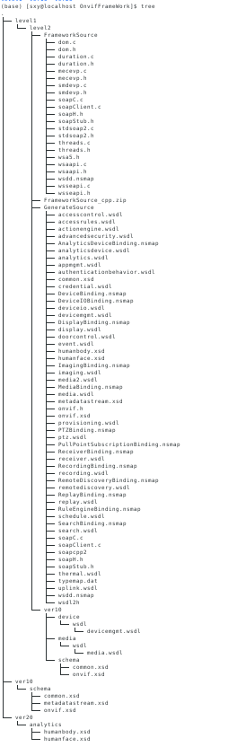

# 设计

## 目的

- 为了使系统中使用的相机不受到其类型的限制

## 要求
- 发现设备
- 设备鉴权
- 设备的一些通用功能的实现
  - 抓图
  - 获取视频流

## 研究过程
- soap编译
- onvif编译
- onvif功能的实现（基于巨峰相机）
- onvif功能检验（其他品牌的相机及自组装的相机）

### gsoap编译
- onvif网站下载wsdl xdl或者直接从ftp下载

  ```
  内网：ftp://pub@192.168.1.238/lib/OnvifFrameWork.zip
  ```



- 下载gsoap（2.8.51）
```
官网：https://sourceforge.net/projects/gsoap2/files/gsoap-2.8/gsoap_2.8.51.zip/download
内网：ftp://pub@192.168.1.238/lib/gsoap_2.8.51.zip
//一开始使用的是最新版的(2.8.99)发生难以解决的错误，换用gsoap_2.8.51.zip正常编译
```

  - 编译centos下的gsoap

  ```
  sudo yum install  openssl
  sudo yum install flex
  sudo yum install bison
  sudo yum install openssl-devel.x86_64
  sudo yum install -y byacc
  ./configure --prefix=/home/sxy/Github/cpp/onvif/resources/gsoap_bin
  make
  sudo make install 
  ```
- 将编译好的可执行文件拷贝到GenerateSource

### onvif编译（centos下）
  ```
cp gsoap-2.8/gsoap/typemap.dat 
OnvifFrameWork/level1/level2/GenerateSource/
cp gsoap_bin/bin/* OnvifFrameWork/level1/level2/GenerateSource/
  ```
- 生成 onvif.h（纯c）

```
./wsdl2h -t  typemap.dat -c  -o onvif.h remotediscovery.wsdl devicemgmt.wsdl analytics.wsdl analyticsdevice.wsdl media.wsdl deviceio.wsdl display.wsdl event.wsdl imaging.wsdl recording.wsdl replay.wsdl search.wsdl receiver.wsdl ptz.wsdl

```
- 添加鉴权功能，修改有关文件
```
1、修改onvif.h头文件，加入#import "wsse.h"
2、将 OnvifFramework\gsoap-2.8\gsoap\import路径下的wsa5.h中的SOAP_ENV__Fault结构体注释掉或改为其他名字，如SOAP_ENV__Fault_alex
```


- 生成客户端文件
```
./soapcpp2 -C -L onvif.h -x -I ../../../../gsoap-2.8/gsoap/import:../../../../gsoap-2.8/gsoap:../../../../gsoap-2.8/gsoap/plugin:../../../../gsoap-2.8/gsoap/custom
```
- 将各个文件复制到同一文件夹下
```
cp soapC.c soapClient.c soapH.h soapStub.h wsdd.nsmap ../FrameworkSource/
```

```
cp ../../../../gsoap-2.8/gsoap/stdsoap2.c ../../../../gsoap-2.8/gsoap/stdsoap2.h .
cp ../../../../gsoap-2.8/gsoap/custom/duration* .
cp ../../../../gsoap-2.8/gsoap/import/wsa5.h .

cp ../../../../gsoap-2.8/gsoap/plugin/wsaapi.* ../../../../gsoap-2.8/gsoap/plugin/wsseapi.c ../../../../gsoap-2.8/gsoap/plugin/wsseapi.h .
cp ../../../../gsoap-2.8/gsoap/plugin/threads.* .
cp ../../../../gsoap-2.8/gsoap/dom.c ../../../../gsoap-2.8/gsoap/import/dom.h .
cp ../../../../gsoap-2.8/gsoap/plugin/mecevp.* .
cp ../../../../gsoap-2.8/gsoap/plugin/smdevp.* .
```
- 编写编译文件
```
cmake_minimum_required(VERSION 2.8)
project(onvif)
#set( CMAKE_CXX_FLAGS "-std=c++11" )
add_compile_options(-DWITH_OPENSSL -DWITH_DOM  -DWITH_NONAMESPACES)
add_executable(${PROJECT_NAME}
"../src/main.c"
"../src/onvif_export.c"
"../src/onvif/smdevp.c"
"../src/onvif/wsseapi.c"
"../src/onvif/dom.c"
"../src/onvif/duration.c"
"../src/onvif/mecevp.c"
"../src/onvif/threads.c"
"../src/onvif/soapC.c"
"../src/onvif/stdsoap2.c"
"../src/onvif/wsaapi.c"
"../src/onvif/soapClient.c"
"../src/onvif/wsdd.nsmap")
message("PROJECT_SOURCE_DIR: "${PROJECT_SOURCE_DIR})

IF (CMAKE_SYSTEM_NAME MATCHES "Linux")
    target_link_libraries( onvif uuid ssl crypto pthread z dl)
ELSEIF (CMAKE_SYSTEM_NAME MATCHES "Windows")
    target_link_libraries( onvif uuid ssl crypto pthread z ws2_32)
ELSE ()
    MESSAGE(STATUS "platform error!")
ENDIF (CMAKE_SYSTEM_NAME MATCHES "Linux")

```

- 编译成功

## 调试功能代码

- 设备发现
- 视频流获取
- 图片获取

