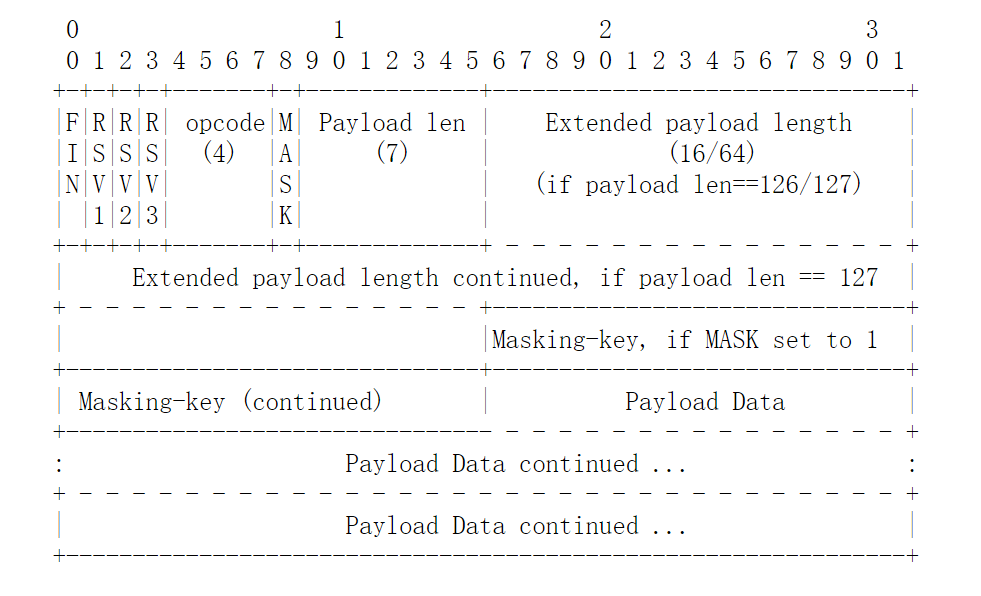

# websocket客户端设计说明

## 1. 引言

### 1.1 编写目的
本文档旨在梳理程序设计架构，并借此文档阐明本程序的设计实现方式。

### 1.2 背景
应需求用C/C++实现websocket客户端编写，以便后续进行二次开发。由于服务端已使用QT的websocket模块实现，故只需实现客户端即可。

### 1.3 定义
提供符合websocket协议的客户端实现，能够与服务端进行稳定通信。

## 2 websocket协议介绍

### 2.1 概述
WebSocket 是一种网络通信协议，RFC6455 定义了它的通信标准。WebSocket 是 HTML5 开始提供的一种在单个 TCP 连接上进行全双工通讯的协议。

### 2.2 背景
websocket协议是为了在某种程度上补充HTTP协议而被设计出来的。
HTTP 协议是一种无状态的、无连接的、单向的应用层协议。它采用了请求/响应模型。通信请求只能由客户端发起，服务端对请求做出应答处理。
这种通信模型有一个弊端：HTTP 协议无法实现服务器主动向客户端发起消息。
这种单向请求的特点，注定了如果服务器有连续的状态变化，客户端要获知就非常麻烦。大多数 Web 应用程序将通过频繁的异步JavaScript和XML（AJAX）请求实现长轮询。轮询的效率低，非常浪费资源（因为必须不停连接，或者 HTTP 连接始终打开）。
因此，工程师们一直在思考，有没有更好的方法，WebSocket 就是这样发明的。WebSocket 连接允许客户端和服务器之间进行全双工通信，以便任一方都可以通过建立的连接将数据推送到另一端。WebSocket 只需要建立一次连接，就可以一直保持连接状态，这相比于轮询方式的不停建立连接显然效率要大大提高。

### 2.3 特点
（1）建立在 TCP 协议之上，服务器端的实现比较容易。
（2）与 HTTP 协议有着良好的兼容性。默认端口也是80和443，并且握手阶段采用 HTTP 协议，因此握手时不容易屏蔽，能通过各种 HTTP 代理服务器。
（3）数据格式比较轻量，性能开销小，通信高效。
（4）可以发送文本，也可以发送二进制数据。
（5）没有同源限制，客户端可以与任意服务器通信。
（6）协议标识符是ws（如果加密，则为wss），服务器网址就是 URI。

### 2.4 通信原理和机制

#### 2.4.1 概述
使用websocket协议进行通信活动需要进行以下步骤：首先终端间需要先建立起TCP连接，在此基础上，客户端发送websocket握手请求，服务端收到后返回一个请求响应，同意请求后，双方正式建立其websocket连接，然后双方可以用websocket协议的数据帧格式进行数据的传输。当数据传输完成后，准备结束连接，终端向对端发送一个关闭请求（close frame），对端收到请求后进行回应，然后由服务端发起底层TCP连接的关闭，当TCP连接关闭后，websocket连接彻底关闭。

#### 2.4.2 websocket建立连接

##### 2.4.2.1 客户端发起的建立WebSocket连接请求
客户端根据输入的URI与对端首先建立更底层的连接（TCP连接）。客户端发起的建立websocket连接请求有如下要求：
（1）URI中的host、port、resource、secure flag都必须符合websocket协议规范的URI格式，如此才能与正确的对端建立连接。具体格式详见4.3节。
（2）如果websocket client正在与一个server建立连接，其必须等待正在建立的连接成功或者失败，才能够进行下一次对同一服务器连接建立的发起，也就是在同一时间点对同一服务器仅允许一个websocke连接的建立。websocket client允许同时对同一服务器发起多个连接请求，但请求数量需要一个合理的限制值以防止拒绝服务类的攻击，客户端需要对这些连接请求创建与一个排序队列。websocket对已建立连接的数量没有限制，但应考虑到终端能力，设置一个合理的数值限制连接数量。
（3）websocket连接的建立允许使用代理。
（4）如果websocket连接失败，客户端应当终止连接。
（5）如果secure flag被设置，客户端应当在连接建立之后，在握手数据（handshake data)发送之前，进行TLS握手。如果TLS握手失败，则必须终止连接。

##### 2.4.2.2 客户端发送握手请求
在与服务端建立起连接后，客户端需要发送一个握手请求，其要求如下：
（1）握手请求必须是一个合法的HTTP请求。
（2）请求方式必须为GET，HTTP协议版本必须大于等于1.1。
（3）必须有HOST头，其格式为hostname[:port]。（端口默认80或443）
（4）必须有Upgrade头，其值必须包含 websocket 关键字。
（5）必须有Connection头，其值为必须包含"Upgrade"。
（6）必须有Sec-WebSocket-Key头，其值为随机生成的16字节的值用BASE64编码后的字符串，提供基本的防护，比如拒绝恶意的连接，或者无意的连接。
（7）若客户端为浏览器，则必须有Origin字段，其值为请求发起方的Origin的ASCII序列。(因为中间可能经过代理才到达服务器，服务器可以根据该字段选择是否和客户端建立连接)，若为非浏览器的客户端，若有与该情况下浏览器相同的行为，也可以设置该字段。
（8）必须有Sec-WebSocket-Version头，其值为13，如果服务端不支持该版本，需要返回一个Sec-WebSocket-Versionheader，里面包含服务端支持的版本号。
（9）可选头Sec-WebSocket-Protocol，其值为由逗号分隔的子协议的名字，按优先度排序，每个名字必须唯一。
（10）可选头Sec-WebSocket-Extension，表示协议级别的扩展。
（11）除以上要求外，可有其它任意符合HTTP的协议头，例如cookies之类的都可以。

如下便是一个客户端websocket请求报文。
``` markdown
   GET/chat HTTP/1.1
   Host:server.example.com
   Upgrade:websocket
   Connection:Upgrade
   Sec-WebSocket-Key:dGhlIHNhbXBsZSBub25jZQ==
   Origin:http://example.com
   Sec-WebSocket-Protocol:chat,supchat
   Sec-WebSocket-Version:13
```

##### 2.4.2.3 客户端接收服务端的响应
当客户端发送了一个握手请求，它必须等待服务端的响应报文，并验证其是否合法。如果合法，才能够与服务端进行进一步通信。服务端响应报文有如下要求：
（1）响应状态码必须为101，表示协议切换。若非101，按照HTTP协议规程处理响应。
（2）必须有Upgrade字段，其值必须包含不区分大小写的ASCII字符串"websocket"，否则，客户端关闭连接。
（3）必须有Connection字段，其值为必须包含不区分大小写的ASCII字符串"Upgrade|"，否则，客户端关闭连接。
（4）必须有Sec-WebSocket-Accept字段，其值生成规则：服务端拿到Sec-WebSocket-Key，假如其为“dGhlIHNhbXBsZSBub25jZQ\==”，服务端就把该串和“258EAFA5-E914-47DA-95CA-C5AB0DC85B11”拼接起来，变成“dGhlIHNhbXBsZSBub25jZQ==258EAFA5-E914-47DA-95CA-C5AB0DC85B11",后取这个串的SHA1摘要，再用BASE64编码，编码后的串即为Sec-WebSocket-Accept的值，Sec-WebSocket-Accept值中忽略所有空格。不符合上述，客户端关闭连接。
（5）如果有Sec-WebSocket-Extensions字段，其值必须为客户端发送握手请求中的Sec-WebSocket-Extension中包含的一个或多个协议扩展，否则，客户端断开连接。
（6）如果有Sec-WebSocket-Protocol字段，其值必须为客户端发送握手请求中的Sec-WebSocket-Protocol中包含的一个或多个子协议，否则，客户端断开连接。

如下便是一个服务端websocket回应报文。
``` markdown
   HTTP/1.1 101 Switching Protocols
   Upgrade:websocket
   Connection:Upgrade
   Sec-WebSocket-Accept:s3pPLMBiTxaQ9kYGzzhZRbK+xOo=
   Sec-WebSocket-Protocol:chat
```
需要指出的时，无论时HTTP请求报文还是HTTP响应报文，其字段名称都是不区分大小写的。
如果满足上述连接建立，握手请求报文发送，握手响应报文的接收和验证的所有要求，对于客户端来说，一个websocket连接就已经完全建立起来了。

#### 2.4.3 websocket数据帧

##### 2.4.3.1 概述
websocket 协议规定使用帧序列进行数据传输。其为了避免网络中介混乱以及网络安全问题，在数据传输中采用掩码；用opcode区分数据帧的类型；用payload length来指定payload data的位置；用payload data来承载用户数据。在未发送close frame之前，双方都可以进行数据传输。
下图为RFC 6455给出的协议格式：


##### 2.4.3.2 字段解释：
（1）FIN：1 bit，代表其是否是尾帧，如果为1则该消息为消息尾部,如果为零则还有后续数据包，首帧也由可能时尾帧（只有一个分片）。
（2）RSV1、RSV2、RSV3：每个1 bit，保留的。若建立连接时使用了扩展（Sec-WebSocket-Extension），那么这些位的含义应该已协商好且均不为0,如果没有扩展约定的情况则必须全部为0，如果出现非零的值，且并没有采用WebSocket扩展，连接需断开。
（3）opcode：4 bit，定义payload data的类型：（如果接收到未知的opcode，接收端必须关闭连接)
* 0x0 ：continuation frame，当Opcode为0时，表示本次数据传输采用了数据分片，当前收到的数据帧为其中一个数据分片。
* 0x1 ：text frame
* 0x2 ：binary frame
* 0x3 - 0x7 ：保留，for non-control frame
* 0x8 ：close frame
* 0x9 ：ping frame
* 0xA ：pong frame
* 0xB - 0xF ：保留，for control-frame

（4）MASK：表示payload data是否被masked。从客户端向服务端发送数据时，必须对数据进行掩码操作；从服务端向客户端发送数据时，不需要对数据进行掩码操作，若客户端收到经掩码处理的数据帧，则连接需断开。
（5）Payload length：7 bits 或 7 bits + 16 bits 或 7 + 64 bits。若值为0-125 ：则Payload data的长度即为该值，126 ：那么接下来的2个字节才是Payload Data的长度（unsigned），127 ：那么接下来的8个字节才是Payload Tada的长度（unsigned）。注意，必须使用最小字节数编码长度。
（6）Masking-Key：0 or 4 bytes，只有客户端给服务端发的包且这个包的MASK字段为1，才有该字段。
（7）Payload Data：包括Extension Data和Application Data，若handshake时使用了Sec-WebSocket-Extension，则Extension Data的长度由Sec-WebSocket-Extension的值指定，或由其推导出，Application Data的长度为Payload length - Extension Data length。若没使用Sec-WebSocket-Extension，则Extension Data 长度为0，Application Data的长度为Payload length。

##### 2.4.3.3 掩码算法
掩码键（Masking-key）是由客户端挑选出来的32位的随机数。掩码操作不会影响数据载荷的长度。掩码、反掩码操作都采用如下算法：
首先，假设：
* `original-octet-i`：为原始数据的第i字节。
* `transformed-octet-i`：为转换后的数据的第i字节。
* `j`：为i mod 4的结果。
* `masking-key-octet-j`：为mask key第j字节。

算法描述为：`original-octet-i`与`masking-key-octet-j`异或后，得到`transformed-octet-i`，其中`j = i MOD 4`。
即为，`transformed-octet-i = original-octet-i XOR masking-key-octet-j`。

##### 2.4.3.4 数据分片（Fragmentation）
数据分片的最主要的原因是能够发送大小未知的消息，不用先将消息缓冲。对于不能进行分片的消息，要先将整个消息缓冲，得到其大小后再进行发送。当采用分片时，服务端或者网络中介可以选择一个合适的大小缓冲，然后将分片写入网络。（例如缓冲区满了，无法缓冲过大的数据）
数据分片的第二种应用场景是实现多路并发。将一个大的消息分片能够防止其长时间占据输出信道，而影响其他的通信进行。
除非协议拓展特别指出，帧本省没有语义。如果没有客户端和服务端协商的协议扩展或者网络中介能够完全理解约定的协议扩展，网络中介即有可能对帧进行分割和重组。
数据分片具有以下要求：
（1）一个完整的帧（不分片）的FIN位被置为1（已设置），其opcode位是一个非0的数。
（2）一个被分片过的信息由一个FIN位未被设置（为0），opcode位为非0值的帧开始，后续若干帧的FIN位未被设置，opcode位为0值（或直接接尾帧），终止于一个FIN位被设置（为1），opcode位为0值的帧，这样的帧序列组成，其在概念上与一个大的完整的帧是一样的。但是，但设置了协议扩展的话，上述的等价可能会被打破。
（3）控制帧能够插入到分片帧的传递之中，控制帧本身不能被分片。
（4）消息分片必须按照发送方的发送顺序被递交到消息接收方。
（5）两个消息的分片不能相互交叉发送，除非协议扩展能够对交叉做出解析。
（6）终端必须拥有处理夹杂在分片帧序列中控制帧的能力。
（7）消息的发送端可能对非控制消息执行任意大小的分割。
（8）客户端和服务端必须拥有接收分片帧和完整帧的能力。
（9）网络中介不能尝试将控制帧分片。
（10）如果网络中介不能理解客户端和服务端约定的协议扩展，网络中介即有不对帧进行（再）分割和(再)重组。
（11）依据上述规则，一个消息的所有帧都是相同得1数据类型，这个类型被第一个分片帧的opcode设置，为二进制类型，文本类型或其他保留类型。

##### 2.4.3.5 控制帧
opcode最高位的值为1的帧均为控制帧，控制帧目前有close frame（0x8），ping frame（0x9），pong(0xA)以及剩余的保留帧。控制帧是用于侦测websocket连接状态。控制帧的负载长度(payload length)为125btyes或者小于这个值。
（1）Close
close frame包含一个值为0x8的opcode位，可能也包含一个指出其关闭理由的数据体（Application Data）。这个数据体的前2bytes是一个2-byte的无符号整数（按网络字节序），代表一个状态码，接下来的2-byte整数可能包含一个UTF-8编码的数据，代表关闭理由。这些信息是针对调试所传递，并不一定是用户可读的，不必向用户传递。
在发送一个close frame后，该终端不能再向对端发送任何消息。
如果一个终端在接收到一个close frame后，之前并没有发送一个close frame，那么它必须向对端发送一个close frame作为响应。（当发送一个close frame作为响应时，通常会返回接收的close frame的状态码）。响应的close frame应尽快发送。终端有可能延迟发送close frame作为响应，因为可能一个消息的分片帧仅发送了部分，将剩余部分发送完后，才进行close frame的发送，但是，不保证已经发送了close frame的终端会继续处理接收的消息。当通信双方都接收到了close frame后，确认关闭连接，就开始关闭底层的TCP连接。服务端需要立刻主动关闭TCP连接，客户端应当等待服务端的关闭请求，但是客户端也可能在收发完close frame后的任何时间点主动关闭TCP连接，比如在一个规定的时间内未收到服务端TCP连接关闭的请求。
如果客户端和服务端和服务端同时发送了close frame，待双方都发送和接收到了close frame后，双方便认为连接关闭了，接着关闭底层的TCP连接。
（2）Ping
ping frame包含一个值位0x9的opcode位，其可能包含"Application Data"。一旦接收到一个ping frame，如果终端没有发送过close frame，终端必须尽快回复一个pong frame。ping可以被用来实现心跳以保持连接或者检测对端是否还有响应。
（3）Pong
ping frame包含一个值位0xA的opcode位，其必须包含"Application Data"，其"Application Data"中的内容必须与要回应的ping中所负载的内容完全相同。如果连续收到多个ping frame，而全部没有来的急回复的话，终端可能仅会回应最近的时间发来的ping frame，而放弃更早时间的ping frame的回复。
（4）Data Frame
opcode位最高位的值为0的帧都是数据帧，数据帧目前包括0x1（Text），0x2（Binary）以及其他还未定义的保留类型。数据帧携带应用层及扩展层的数据，其数据类型决定了数据如何被解析。
* Text
"Payload data"是按UTF-8编码的文本数据，需要指出，特定的text frame可能仅包含部分UTF-8序列，但是完整的消息必须包含有效的UTF-8。
* Binary
"Payload data"完全由任意的二进制数组成，其含义的解析交由应用层来做。

##### 2.4.3.6 Extensibility
协议在设计是就考虑到允许添加扩展，这为基础协议增加了一些额外功能。建立连接（TCP）的终端必须在握手阶段进行关于协议拓展的协商。websocket协议提供0x3-0x7以及0xB到0xF的opcode位，RSV1位和RSV2位以及RSV3位来供协议拓展使用。以下是扩展的一些预期用途。
* Extension Data需要置于Application Data之前。
* 预留位能依据没帧的需求分配。
* 保留的操作码可以被定义。
* 预留位可以分配给操作码，如果必要的。
* 可以从Payload data中提取一些位来定义更多的预留位或者保留操作码。

#### 2.4.4 发送和接收数据

##### 2.4.4.1 发送数据
终端必须执行以下步骤才能在一个websocket连接上发送携带数据的消息。
（1）终端必须确保websocket连接始终处于open状态，任一时刻连接状态改变，都必须终止以下步骤的进行。
（2）终端必须以websocket数据帧格式对数据进行封装。如果要发送的数据过大，或者当终端装备好发送数据时，数据不能提供它本身的完整版本，则需要对数据进行分片发送。
（3）第一个帧所包含的opcode值必须能够被接收方识别并据此解析数据类型（二进制，文本，约定类型）。
（4）最后一个包含数据的帧的FIN位值必须被设置为1。
（5）由客户端发送的数据必须进行掩码处理。
（6）如果websocket连接使用了扩展，数据发送必须考虑到扩展的定义。
（7）封装好的数据必须通过底层的网络连接进行传输。

##### 2.4.4.1 接收数据
为了接收websocket数据，终端必须监听底层的网络连接。传入的数据必须按照websocket数据帧格式进行解析，控制帧必须按照2.4.2.5所述进行处理。数据帧须根据opcode为指出数据类型，其Application Data部分为消息的内容。如果接收的为分片帧则需要等后续帧全部接收到后进行组装，将其视为一个完整的帧进行处理。
扩展可能会改变如何读取数据的语义，具体包括包含数消息边界的内容。扩展也可能修改"Appliaction Data"。
服务端必须对客户端传来的数据进行掩码去除。

#### 2.4.5 关闭连接
为了关闭websocket连接，终端必须关闭底层的网络连接。终端应当使用合适的方法干净的关闭TCP连接，同样也包括TLS会话，如果合适的话，可以丢弃关闭时可能收到的数据。当必要时（例如收到攻击），终端应当尝试任何提供的能够关闭连接的方法。通过2.4.2.5节中close控制帧描述的方式发送close frame的方式进行websocket连接关闭，确定TCP连接管理后，此次连接正式关闭。

## 3 程序系统的组织结构
~~~mermaid
   graph LR
   websocket_client-->message
   message-->server
   server-->message
   message-->websocket_client
   websocket_client--error/status-->progressor
   config--parameter-->websocket_client(websocket client)
   handler-->message
   url-->websocket_client
   constants-->websocket_client
   queue(message queue)-->message
~~~

### 3.1 模块说明
#### 3.1.1 URI 模块
负责对输入这个模块的URI字符串（string）进行处理。通过URI作为传参构造一个URI类对象，包含关于URI的属性和操作，然后传入websocket client来建立连接，其类结构如下：
``` ruby
class uri{
private:
	string shame;
    string host;
    string port;
    string path;
    string query;
public:
	uri(string *ws_uri);
    int check();
    string get_shame();
    string get_host();
    string get_port();
    string get_path();
    string get_query();
}
```
#### 3.1.2 config模块
config模块是构建websocket client的配置模块，里面保存一些配置信息，如下示例所示。
``` ruby
config{
	static const long timeout_connect = 5000;//TCP连接超时
    static const long timeout_open_handshake = 5000;//websocket握手响应超时
    static const long timeout_pong = 5000;//pong响应超时
    static const bool silent_close = false;//是否在关闭时打印log
    static const size_t max_message_size = 32000000;//传输最大数据大小
    static const bool enable_extensions = true;//是否开启扩展
    static const bool max_buff_size = 2048;//数据传输缓冲区大小
    static const long timeout_close_frame =5000;//等待关闭控制帧超时
    ...
}
```

#### 3.1.3 constants模块
constants模块包含程序中所有的常量，不希望被修改的值放在这里。示例如下：
``` ruby
constants{
	static const int client_version = 13;//客户端协议版本
    static const int ws_pot = 80;//ws默认端口
    static const int wss_port = 433;//wss默认端口
    }
```

#### 3.1.4 websocket client模块
websocket客户端，用于实现与服务端通信，通过创建一个ws_client类实现对websocket client的模拟，ws_client类的具体结构如下：
``` ruby
class ws_client{
private:
	int socket;
	int status;
    int socket_request();
    int handshake_request();
    int handshake_check();
    int send_data();
    int read_message();
public:
	int connect(uri &ws_uri)；
    int send(string text);
    int send(char *text_ptr);
    int sendBinary(string binary);
    int sendBinary(char *binary_ptr);
    int ping();
    int ping(string text);
    int ping(char *text_ptr);
    int pong();
    int pong(string text);
    int pong(char *text_ptr);
    int close();
    int close(string text);
    int close(char *text);
}
1`
```

#### 3.1.5 message模块
消息域，包含封装websocket数据帧格式的消息类、握手请求消息类。

``` ruby
class request{
private:
	string header;
    string Host;
    string Upgrade;
    string Connection;
    string Sec_WebSocket_Key;
    string Origin;
    string Sec_WebSocket_Protocol;
    string Sec_WebSocket_Extensions;
public:
	handshake(string path,string host，string port);
    handshake *get_handshake();
    int set_Origin();
    int set_Sec_WebSocktet_Protocol();
    int set_Sec_Websocket_Extensions();
    string process_request();
}
```

``` ruby
class response{
private:
	string header;
    string Upgrade;
    string Connection;
    string Sec_WebSocket_Accept;
    string Sec_Websocket_Protocol;
    string Sec_Websocket_Extensions;
public:
	response(string ws_response);
	int responce_check(string key);
}
```

``` ruby
class data_frame{
private:
	uint8_t fin;
    uint8_t rsv[3];
    uint8_t opcode;
    uint8_t mask;
    uint64_t payload_len;
    uint8_t masking_key[4];
    string payload_data;
    int mask_progress();
    int payload_data_progress();
public:
	data_frame(uint8_t fin, uint8_t *rsv, uint8_t opcode,string *data);
    data_frame(uint8_t fin,uint8_t opcode,string *data);
    data_frame(string *frame);
    data_frame(string *frame, uint64_t payload_len);
    sting data_frame_progress();
    string get_payload_data();
}

```

#### 3.1.6 handler模块
Sec_WebSocket_Key,Sec_WebSocket_Accept生成以及传输数据帧掩码，去除掩码处理。
``` ruby
type random();//产生一个强随机数

string base64_encode(string value);//对字符串进行base64编码

string SHA1(string value);//对字符串进行SHA1

class ws_key{
private:
	string key;
public:
	ws_key();
    string get_key();
}
```

class ws_accept{
private:
	string accept();
public:
	ws_accept(string key);
    string get_accept();
}

#### 3.1.7 progressor模块
主要负责当websocket客户端状态改变时，执行相应回调，当客户端运行出错时，显示错误信息，并采取相应处理措施。
``` ruby
class progressor{
private:
public:
}
```

#### 3.1.8 message_queue模块
主要负责消息的管理，当输入多条消息需要传输或者从对端拿到多条消息，都会有消息队列来进行管理，以保证消息的有效输入输出。

#### 3.1.9 base64模块
实现BASE64算法

#### 3.1.10 SHA1模块
实现SHA1算法


## 4. 程序设计说明

### 4.1 程序说明
websocket客户端程序，实现与websocket服务端实现通讯，主要包括实现连接，发送数据，接收数据，断开连接等功能。

### 4.2 程序主要功能
（1）客户端通过输入URI与服务端建立websocket连接。
（2）客户端能够基于websocket协议向服务端发送文本数据/二进制数据。
（3）客户端能够基于websocket协议接收来自服务端的文件数据/二进制数据。
（4）客户端能够主动断开/被动断开与服务端的连接。

### 4.3 输入项
（1）建立连接的服务端地址
* ws-URI = `"ws:" "//" host [ ":" port ] path [ "?" query ]`
* wss-URI = `"wss:" "//" host [ ":" port ] path [ "?" query ]`

其中，ws表示一般的websocket连接，wss表示基于TLS（Transport Layer Security）；
port选项是可选的，ws-URI默认的的port是80，wss-URI默认的port是443；
resource-name的由以下规则构成：
 * 如果path为空，则以"/"代替。
 * 不为空，则为输入path。
 * 如果query不空，则"?"组件存在。
 * 如果query不空，则为输入query。

片段标识符在WebSocket URIs中是没有意义的，并且不能在这些URIs上使用。与任何URI方案一样，当不指示片段的开始时，字符"#"必须转义为%23。
（2）输入传输数据类型
* 文本数据
文本数据支持string/char*类型。

* 二进制数据
二进制类型支持uint8_t*/vector<uint8_t>类型。

### 4.4 输出项
* 文本数据/二进制数据

### 4.5 流程逻辑

#### 4.5.1 连接
~~~mermaid
   graph LR
   analysis(输入并解析url)--ws/wss.ip.port.path.query-->url_obj(url对象)
   url_obj-->connect
   connect-->result{连接是否有成功}
   result{连接是否有成功}--yes-->success(置状态为已连接,执行连接成功回调)
   result{连接是否有成功}--no-->fail(抛出错误,执行连接失败回调)
~~~

##### 4.5.1.1 解析URI
websocket的URI格式如下：
* ws-URI = `"ws:" "//" host [ ":" port ] path [ "?" query ]`
* wss-URI = `"wss:" "//" host [ ":" port ] path [ "?" query]`

具体分为scheme（ws:或wss:），host，post，path，query五部分，其各部分格式要求如下：
（1）schemd'fe：必须为ws：或wss：，其他格式均为非法协议格式。
（2）host：可以为域名（www.example.com）或者IPv4地址。
（3）port：其值不能大于65535，ws默认端口为80，wss默认端口为443。
（4）path：资源路径，包含虚拟目录和文件名。
（5）query：查询组件，传入的参数格式为`key=value&key=value`,参数间由"&"隔开。
例如：```http://www.aspxfans.com:8080/news/index.asp?boardID=5&ID=24618&page=1```
其中，scheme="http"，host="www.aspxfans.com"，port="8080"，path="/news/index.asp"（其中虚拟目录为"/news/"，文件名为"index.asp"）,query="boardID=5&ID=24618&page=1"。
将传入的URI作为其构造函数参数，在构造函数中进行模式匹配将URI按上述部分分段，分别初始化uri类对象对应的数据成员，如果没有某一分段则将对应数据成员初始化为默认值，若无默认值，则输入URI非法，不再继续执行下述步骤。
调用check方法验证其传入的URI是否是一个有效的URI,满足上述格式要求。

##### 4.5.1.2 建立连接
依据2.4.2节所述，将上面得到的URI对象传入ws_client的connect方法，调用socket_request方法开始建立连接。socket_request采用socket套接字与IP：port所标识的服务端进行TCP连接。此时ws_client中的数据成员status由CLOSED变为CONNECTING。需要注意的是，传入的host可能是域名也可能是IP地址，如果是域名的话，需要将其转化为IP地址。（考虑到对一个或多个服务端同时发起连接的可能性，当有连接在进行时，需要将其他的连接请求加入队列中，依据队列顺序依次进行连接请求，本程序限制队列长度为10。）
建立TCP连接后，客户端需要向服务端发送握手请求报文，请求报文的格式及要求如2.4.2.2节所述，本程序提供的握手报文如下所示：
``` markdown
   GET resource HTTP/1.1
   Host:host[:port]
   Upgrade:websocket
   Connection:Upgrade
   Sec-WebSocket-Key:随机生成的16字节的值用BASE64编码后的字符串
   Origin:...
   Sec-WebSocket-Protocol:...
   Sec-WebSocket-Version:13
```
其中，resource为要访问的资源，即为uri类中的path。Orign，Sec-WebSocket-Protocl字段由用户选择输入，默认为空。
ws_client中的connect方法通过调用handshake方法声明一个3.1节所述的message域中的handshake类，来抽象出一个握手请求，调用类函数成员process_handshake()将其进行相应的处理，该方法返回一个满足上述报文格式的string对象指针。将string对象指针通过wx_buff作为参数传入writen函数中,这样握手请求便向服务端发送了。
此时，客户端需要等待服务端返回响应握手报文，调用select函数实现IO复用，监听socket套接字，当服务端有消息传入时，将消息读入ws_client中的数据成员rx_buff中，调用handshake_check函数验证服务端返回的响应握手报文是否合法（handshake_check通过调用handshake类中的responce_check方法执行具体的验证过程）,验证方式如2.4.2.3节所述。若验证不通过，则说明与服务端建立websocket连接失败，客户端断开连接，并将status置为CLOSED，不再继续执行下述步骤,若验证通过则将status置为CONNECTED，并执行相应回调。
服务器返回的握手响应报文格式如下：
``` markdown
   HTTP/1.1 101 Switching Protocols
   Upgrade:websocket
   Connection:Upgrade
   Sec-WebSocket-Accept:...
   Sec-WebSocket-Protocol:...
```

#### 4.5.2 发送消息
~~~mermaid
   graph LR
   ayalysis(解析输入消息)-->result_message{是否为有效消息}
   result_message--yes-->handle(处理消息)
   result_message--no-->error(信息无效,抛出错误,退出发送流程)
   handle-->transport(传输消息)
   transport-->result_transport{消息是否传输成功}
   result_transport--yes-->success(执行传输成功回调)
   result_transport--no-->fail(抛出错误,执行传输失败回调)
~~~

##### 4.5.2.1 消息帧
若双方握手成功，则可以进行双向通信。websocket提供两种消息类型以及自定义消息类型的通信方式。两种基本的数据类型分别是UTF-8编码的文本信息和二进制信息通过，自定义类型通过websocket提供的扩展实现。ws_client类中给出send方法实现UTF-8编码的文本信息传输，给出sendBinary方法实现二进制信息传输，两种方法传入参数类型可以为char *类型或者string类型。send或sendBinary方法判断是否需要进行数据分片传输，如果传入数据大小大于wx_buff大小则需要进行分片，以保证每次传输的数据大小不要超过MAX_BUFF_SIZE(这里需要考虑到websocket报文头的大小)，send和sendBinary通过调用或循环调用send_data方法来进行数据传输，send_data创建一个data_frame对象，调用data_frame类中的data_frame_progress将传入的数据格式化为websocket数据帧格式，需要指出的是，客户端发送的数据需要掩码，其具体格式要求如2.4.3节所述。然后调用writen函数将websocket数据帧传输至对端并返回传输结果，执行相应回调。

##### 4.5.2.2 控制帧
这里只考虑ping、pong，close属于关闭连接部分。ws_client提供ping和pong方法发送ping frame和pong frame，ping frame和pong frame的发送要求如2.4.3.5节所述，将输入内容（或为空）调用send_data方法封装为websocket数据帧格式，调用writen函数发送，需要注意的是，控制帧不能进行分片，需要考虑输入内容大小。

#### 4.5.3 接收消息
~~~mermaid
   graph LR
   analysis(解析传入消息)-->result_message{解析是否成功}
   result_message--yes-->success(处理消息,执行接收消息自定义回调)
   result_message--no-->fail(抛出错误,执行接收消息失败回调)
~~~

终端进入CONNECTED状态，即开始通过select函数开始监听socket，当有消息从对端传入时，调用readn函数读取数据到rd_buff中，读取成功后，其返回值位实际读取到的字节数。用rd_buff中的数据（确切的说是一个数据帧）构造一个message域data_frame对象，根据websocket数据帧格式分析传入数据各位代表含义分别将fin、rsv[3]、opcode、mask、payload_len（Payload length可能为7位，7+16位，7+64位，若Payload length前7位的值value在0~125之间，则Payload length占7位，payload_len=value，若value=126，则后续2个字节代表的16位无符号整数的值为payload_len大小，Payload length占7+16位，若value=127，则后续8个字节代表的64位无符号整数的值（最高位为0）为payload_len大小，Payload length占7+64位）、masking_key（若mask值为1，则masking_key存在，否则，不存在，masking_key占32位）、payload_data（其大小位payload_len大小）初始化，然后调用get_payload_data方法处理payload_data并获得数据，执行相应回调。
若fin值1为且opcode值不为0x0，则读取到的是个完整的数据帧。这里有2种情况，一种是rx_buff能容纳下完整的数据帧，另一种是rx_buff不能容纳完整的数据帧吗，即payload_data还有data_frame_size-MAX_BUFF_SIZE大小的数据未读取，需要在下一次读取中将其取出，调用拼接至此次读取数据的末尾形成一个完整的数据帧，再构造data_frame对象。
若fin的值为0或者opcode为0x0，则读取到的是分片帧，同样也如同上述完整帧的处理方式，但需要声明vector<data_frame>容器来存储所用的分片帧，以fin=0，opcode!=0x0的分片帧为头，以fin=1，opcode=0x0的分片帧为尾，分片帧保持UTF-8编码或二进制数格式，不进行处理，将所有分片数据组合后再统一进行处理，返回服务端传来的消息，并执行相应回调。

#### 4.5.4 关闭
~~~mermaid
   graph LR
   request(请求关闭)-->wait(等待服务端关闭报文)
   wait-->result{期限内是否接收到关闭报文}
   result--yes-->close(正式关闭,修改客户端状态,执行关闭客户端回调)
   result--no-->retry(关闭失败,抛出错误,执行关闭失败回调)
   get(接收到服务端关闭报文)-->transport(传输剩余消息)
   transport-->closed(正式关闭)
~~~

##### 4.5.4.1 被动关闭
当接收到的数据被解析为一个close frame后（opcode=0x8），说明对端请求关闭。如2.4.3.5节的close frame中所述，此时，客户端需要向服务端发送一个close frame作为对对端关闭请求的响应，说明同意关闭。客户端所发送的close frame需要等到客户端当前所有消息发送完毕，才能进行传输，发送完close frame后不可再发送任何消息。调用send_data方法向服务端发送一个作为响应消息的close frame控制帧，将status置为CLOSING，然后等待服务端主动关闭TCP连接，等待底层TCP连接关闭后，websocket连接完全关闭，status为CLOSED，执行相应回调。关于close frame格式如2.4.3.5节的close frame所述。

##### 4.5.4.2 主动关闭
客户端无正当理由不可主动关闭websocket连接。ws_client提供close方法关闭websocket连接，close方法通过调用send_data方法向服务端发送一个close frame控制帧，将status置为CLOSING，然后等待服务端对于该close frame的响应，接收到来自服务端的close frame后，等待服务端主动关闭TCP连接，等待底层TCP连接关闭后，websocket连接完全关闭，连接状态status为CLIOSED，执行相应回调。关于close frame格式如2.4.3.5节的close frame所述。

##### 4.5.4.3 部分关闭状态码的定义
* 1000：表示正常关闭，信息已传输完毕。
* 1001：表示终端离开连接。
* 1002：表示协议错误，终端终止连接。
* 1003：表示终端所接收到的数据类型无法识别。
* 1004：保留，供将来使用
* 1005：保留，并非用于表示终端状态的状态码，表示实际上无状态码存在。
* 1006：保留，表示连接在非一般情况下关闭。
* 1007：表示接收到的消息中数据类型标识与具体数据类型不一样。
* 1008：表示接收到的消息违反它的政策，若没有合适的返回状态码，一般使用此状态码返回。
* 1009：表示接收到的消息过大，无法处理。
* 1010：客户端专用，表示请求使用的扩展未在服务端发出的握手请求响应相应字段中出现。其理由字段中一定需要包含请求的扩展名。
* 1011：表面服务端遭遇意外的情况，无法正常处理请求。
* 1015：表示未能执行TLS握手导致连接失败。

## 5 未完成项

### 5.1 TLS模式下的websocket连接
通过TLS（传输层安全协议）实现传输过程中的数据加密。

### 5.2 websocket协议级别的扩展
实现对websocket协议基本功能的扩展，比如实现其他数据类型的数据传递，比如压缩数据进行传输。

### 5.3 http握手请求子协议
暂未支持。

### 5.4 websocket连接的建立允许使用代理
借助中间代理与实现客户端与服务端进行通信。

### 5.5 多连接
websocket客户端可以同时连接不同的服务端或者可以与同一个服务端有多条连接。

## 6 总结
一个相对简单的websocket客户端程序设计，其设计方案完全依照RFC 6455中的要求作为设计依据，实现websocket客户端与服务端通信，部分未实现部分以及将来要做的部分见第5节。


